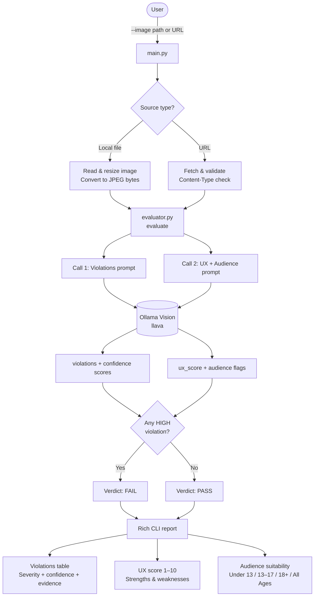

# ad-image-evaluator


Automated evaluation of Search Ad images for policy compliance, user experience quality, and audience suitability — powered by Ollama Vision running locally.

## Goal

This tool automates the detection of policy violations, UX quality assessment, and audience classification for image-based ad assets — using a single local vision model call per image to return a structured compliance report.

## Why use this tool

- **Consistent** — same policy criteria applied identically on every image, no reviewer drift
- **Fast** — results in seconds per image, no review queues
- **Scalable** — evaluate every image before it goes live, not just a sample
- **Free to run** — fully local, no API costs regardless of volume
- **Actionable output** — structured JSON feeds directly into downstream systems, dashboards, or ticketing


## What it evaluates

### Policy violations

| Violation | Severity | Description |
|---|---|---|
| Poor Visual Quality | Medium | Blurry, pixelated, or low-resolution image |
| Excessive Blank Area | Medium | Large empty regions that waste ad real estate |
| Incorrect Orientation | High | Wrong aspect ratio for the ad placement |
| Profanity | High | Offensive or vulgar text in the image |
| Clickbait | High | Sensationalist or misleading content |
| Weapons | High | Firearms, knives, or other weapons depicted |
| CTA Text on Button | High | Call-to-action text on a plain button element — simulates interactive UI, which is prohibited |
| Simulated Interactive Elements | High | Fake search bars, prefilled inputs, or form fields that mimic native platform UI |

### UX score (1–10)
Rates visual clarity, composition, message legibility, and overall ad effectiveness.

### Audience suitability
Classifies the image as appropriate or not for: Under 13 / 13–17 / 18+ / All Ages, with a recommended targeting suggestion.

## How it works

Two focused model calls are made per image — one for policy violations, one for UX and audience. Keeping them separate gives the model a narrower task each time, which reduces context overload and improves accuracy on both areas. When a single prompt asks the model to check compliance, score UX, and classify audience simultaneously, it tends to trade off precision across all three. Splitting the calls lets each prompt do one thing well. The overall verdict is computed from the violations result: **FAIL** if any HIGH severity violation is detected, **PASS** otherwise.



## Setup

**1. Install and start Ollama**

Download from [ollama.com](https://ollama.com), then pull the vision model:

```bash
ollama serve
ollama pull llava
```

**2. Install Python dependencies**

```bash
python -m venv venv
source venv/bin/activate
pip install -r requirements.txt
```

**3. Configure the model (optional)**

Copy `.env.example` to `.env`. The default model is `llava` — change it if you want to use a different Ollama vision model:

```
OLLAMA_MODEL=llava
```

## Usage

```bash
# Evaluate a local image
python main.py --image images/ad.jpg

# Evaluate from a direct image URL
python main.py --image https://example.com/ad.png
```

## Output

A Rich CLI report showing:
- A violations table with severity, detection status, confidence score, and evidence
- UX score (1–10) with qualitative notes on strengths and weaknesses
- Audience suitability breakdown per age group with a targeting suggestion
- An overall PASS / FAIL verdict with a count of high-severity violations
